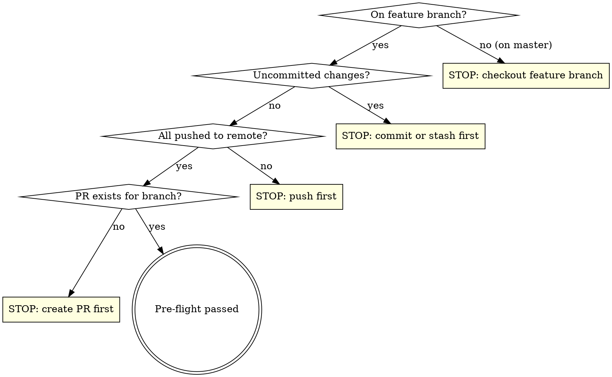

# Deploy Plugin

Prepare and deploy a versioned release of Another Blocks for Dokan.

## Step 0: Quality Gate

Run the full quality suite **before** anything else. All must pass to proceed.

```bash
npm run build
composer lint
composer test
```

If any fail, **stop immediately**. Report the exact error and ask:

> **Quality gate failed.** `<tool>` reported errors:
>
> ```
> <error output>
> ```
>
> Should I attempt to fix this?

Wait for the user's answer. If they say yes, attempt the fix, re-run the failing check, and restart this step from the top. If the fix doesn't work, stop — do not proceed to pre-flight.

## Pre-flight Checks

After the quality gate passes, verify the branch is clean and ready:



Run these checks:

```bash
# Must not be on master
git branch --show-current  # should NOT be "master"

# No uncommitted changes
git status --porcelain     # should be empty

# All pushed
git log @{u}..HEAD --oneline  # should be empty

# PR exists
gh pr view --json number,title,state -q '.number'  # should return PR number
```

If any check fails, **stop and tell the user** what needs to be done. Do not proceed.

## Step 1: Ask Version Type

Ask the user:

> What type of release? **(patch / minor / major)**
>
> Current version: `<read from package.json>`

Wait for their answer. Do not assume.

## Step 2: Bump Version

```bash
npm run version:<type>
```

This script updates: `package.json`, `composer.json`, `the-another-blocks-for-dokan.php` (header + constant), `readme.txt` (stable tag), and syncs lock files.

## Step 3: Update Changelog

The version bump script adds a placeholder `* Version bump` entry in `readme.txt`. Replace it with a real changelog derived from the PR.

1. Fetch the PR body:
   ```bash
   gh pr view --json body -q '.body'
   ```

2. Read the PR title and commits:
   ```bash
   gh pr view --json title -q '.title'
   git log master..HEAD --oneline
   ```

3. Write a changelog entry in WordPress readme.txt format:
   ```
   = X.Y.Z - YYYY-MM-DD =
   * Fix: ...
   * Add: ...
   * Refactor: ...
   ```

   Use the PR summary bullets and commit messages as source material. Each line should start with a category prefix: `Fix:`, `Add:`, `Refactor:`, `Docs:`, `Chore:`.

4. Replace the placeholder entry in `readme.txt`.

## Step 4: Validate Lock Files

Confirm lock files are consistent:

```bash
# Check npm lock file is up to date
npm install --package-lock-only
# Check composer lock file is up to date  
composer validate --no-check-all
```

If either fails, fix the issue before proceeding.

## Step 5: Build and Local Verify

```bash
npm run build
composer lint
composer test
```

All three must pass. If lint or tests fail, attempt to fix the issue (one attempt). If the fix doesn't work, stop and tell the user.

## Step 6: Commit and Push

Stage all version bump changes and commit:

```bash
git add -A
git commit -m "chore: bump version to X.Y.Z, update changelog"
git push
```

## Step 7: Monitor CI

After pushing, monitor the CI workflow:

```bash
# Wait a moment for CI to pick up the push, then watch
gh run list --branch <branch> --limit 1 --json databaseId,status,conclusion
```

Poll the CI run status (use `/loop` or periodic checks). Report outcome:

- **CI passes**: Tell the user the release is ready and the PR can be merged.
- **CI fails**: Fetch the failed job logs, identify the error, attempt one fix, commit, push, and re-monitor. If the second attempt also fails, stop and show the user the error.

```bash
# Get failed run details
gh run view <run-id> --log-failed
```
